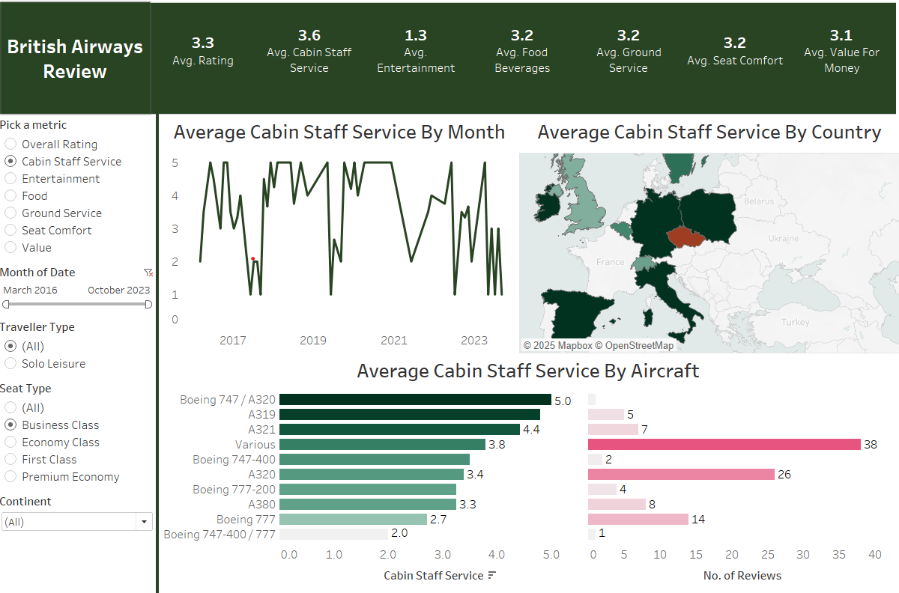

# British Airways Review Analysis ✈️📊

This project explores customer reviews of **British Airways** using Tableau. The dashboard provides insights into customer sentiment, common issues, ratings by category, and trends over time based on a dataset of reviews.

## 🔍 Overview

The analysis answers key questions such as:
- What are the overall sentiments of the reviews?
- Which areas (e.g., staff service, food, comfort) are rated the highest and lowest?
- Are there noticeable trends in customer satisfaction over time?
- How does cabin class or route affect ratings?

The Tableau dashboard provides interactive filters to explore reviews by:
- Cabin Class
- Rating Category
- Year
- Sentiment

## 📁 Repository Contents
 - ba_reviews.csv
 - Countries.csv

